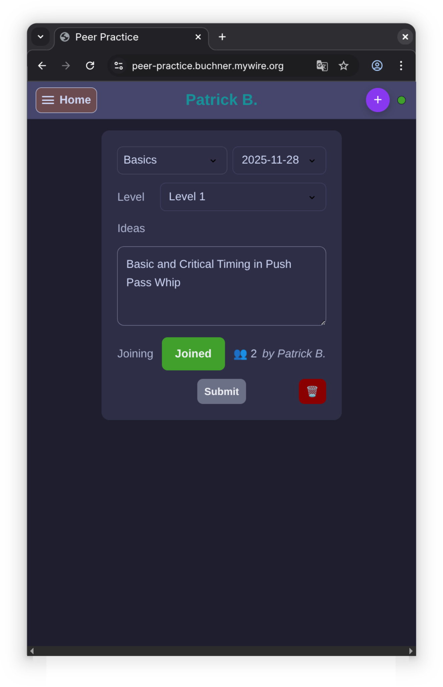

# Peer Practice

This application helps West Coast Swing dancers coordinate each others to find slots to practice with each others.
It provides a web view after logging in, where all dancers can post practice ideas.

The application is prepared for the current state of super-secret-moves.com, where the peer practice is done every 
second and fourth Friday of a month.



## Development
To build the system following tools are required:
- [Rust](https://rust-lang.org/) (cargo, rustc, rustup)
- [Trunk](https://trunkrs.dev/) 
- [Bacon](https://dystroy.org/bacon/)
- [Tailwindcss](https://tailwindcss.com/)

### Nix
For ease of development and distribution on unix systems a nix flake is provided. It provides rules to build easer the 
browser frontend or the native binary for aarch64/x86_64 targets. 

```shell
cd /path/to/peer_practice
nix develop
```

Then use multiple shells for the different tasks:
- To run the server application modify the bacon.toml for local use
    ```shell
    bacon peer-practice
    ```
- To build and watch the frontend
  ```shell
  cd web-leptos
  trunk serve
  ```
  
### Direnv
Usage of the nix flake is optional but recommended through [direnv](https://direnv.net/).
Then allow the automatic instantiation of the nix environment when entering the project directory:
```sh
direnv allow .
```
